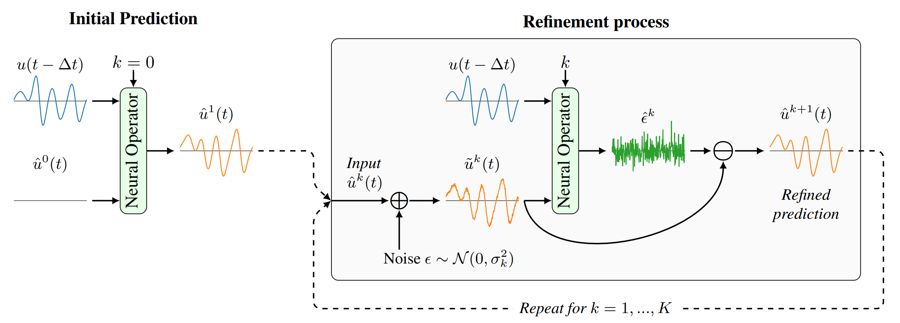
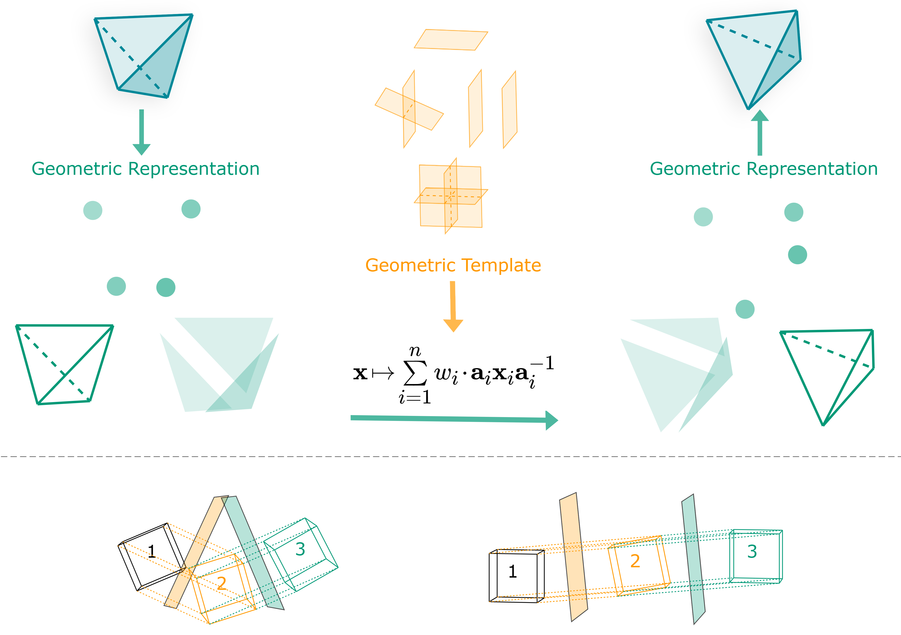
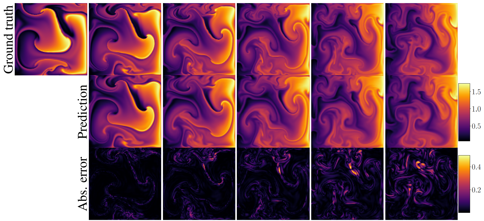

<!-- This is automatically generated from research.yml. Do not edit this file directly. -->
# Research

Following is a list of research papers that have been published using the PDEArena framework.

If you have used PDEArena in your research, and would like it listed here, please add your paper to [this file](https://github.com/microsoft/pdearena/blob/main/docs/research.yml) by sending a pull request to the [PDEArena repository](https://github.com/microsoft/pdearena).

<figure markdown>
{ width="500"}
<figcaption>
<!-- Large font: -->
<h2>
<a href="https://arxiv.org/abs/2308.05732">PDE-Refiner - Achieving Accurate Long Rollouts with Neural PDE Solvers</a>
</h2>
</figcaption>
</figure>

Phillip Lippe 1, Bastiaan S. Veeling 1, Paris Perdikaris 1, Richard E. Turner 1, Johannes Brandstetter 1

<small>1Microsoft Research AI4Science</small>

**Abstract:** Time-dependent partial differential equations (PDEs) are ubiquitous in science and engineering. Recently, mostly due to the high computational cost of traditional solution techniques, deep neural network based surrogates have gained increased interest. The practical utility of such neural PDE solvers relies on their ability to provide accurate, stable predictions over long time horizons, which is a notoriously hard problem. In this work, we present a large-scale analysis of common temporal rollout strategies, identifying the neglect of non-dominant spatial frequency information, often associated with high frequencies in PDE solutions, as the primary pitfall limiting stable, accurate rollout performance. Based on these insights, we draw inspiration from recent advances in diffusion models to introduce PDE-Refiner; a novel model class that enables more accurate modeling of all frequency components via a multistep refinement process. We validate PDE-Refiner on challenging benchmarks of complex fluid dynamics, demonstrating stable and accurate rollouts that consistently outperform state-of-the-art models, including neural, numerical, and hybrid neural-numerical architectures. We further demonstrate that PDE-Refiner greatly enhances data efficiency, since the denoising objective implicitly induces a novel form of spectral data augmentation. Finally, PDE-Refiner's connection to diffusion models enables an accurate and efficient assessment of the model's predictive uncertainty, allowing us to estimate when the surrogate becomes inaccurate.

---

<figure markdown>
{ width="500"}
<figcaption>
<!-- Large font: -->
<h2>
<a href="https://arxiv.org/abs/2302.06594">Geometric Clifford Algebra Networks</a>
</h2>
</figcaption>
</figure>

David Ruhe 1, Jayesh K. Gupta 2, Steven de Keninck 3, Max Welling 1, Johannes Brandstetter 1

<small>1Microsoft Research AI4Science, 2Microsoft Autonomous Systems and Robotics Research, 3University of Amsterdam</small>

**Abstract:** We propose Geometric Clifford Algebra Networks (GCANs) for modeling dynamical systems. GCANs are based on symmetry group transformations using geometric (Clifford) algebras. We first review the quintessence of modern (plane-based) geometric algebra, which builds on isometries encoded as elements of the *Pin*(p,q,r) group. We then propose the concept of group action layers, which linearly combine object transformations using pre-specified group actions. Together with a new activation and normalization scheme, these layers serve as adjustable geometric templates that can be refined via gradient descent. Theoretical advantages are strongly reflected in the modeling of three-dimensional rigid body transformations as well as large-scale fluid dynamics simulations, showing significantly improved performance over traditional methods.

---

<figure markdown>
{ width="500"}
<figcaption>
<!-- Large font: -->
<h2>
<a href="https://arxiv.org/abs/2209.15616">Towards Multi-spatiotemporal-scale Generalized PDE Modeling</a>
</h2>
</figcaption>
</figure>

Jayesh K. Gupta* 1, Johannes Brandstetter* 2

<small>1Microsoft Autonomous Systems and Robotics Research, 2Microsoft Research AI4Science</small>

**Abstract:** Partial differential equations (PDEs) are central to describing complex physical system simulations. Their expensive solution techniques have led to an increased interest in deep neural network based surrogates. However, the practical utility of training such surrogates is contingent on their ability to model complex multi-scale spatio-temporal phenomena. Various neural network architectures have been proposed to target such phenomena, most notably Fourier Neural Operators (FNOs), which give a natural handle over local & global spatial information via parameterization of different Fourier modes, and U-Nets which treat local and global information via downsampling and upsampling paths. However, generalizing across different equation parameters or time-scales still remains a challenge. In this work, we make a comprehensive comparison between various FNO, ResNet, and U-Net like approaches to fluid mechanics problems in both vorticity-stream and velocity function form. For U-Nets, we transfer recent architectural improvements from computer vision, most notably from object segmentation and generative modeling. We further analyze the design considerations for using FNO layers to improve performance of U-Net architectures without major degradation of computational cost. Finally, we show promising results on generalization to different PDE parameters and time-scales with a single surrogate model.

---

<figure markdown>
{ width="500"}
<figcaption>
<!-- Large font: -->
<h2>
<a href="https://arxiv.org/abs/2209.04934">Clifford Neural Layers for PDE Modeling</a>
</h2>
</figcaption>
</figure>

Johannes Brandstetter 1, Rianne van den Berg 1, Max Welling 1, Jayesh K. Gupta 2

<small>1Microsoft Research AI4Science, 2Microsoft Autonomous Systems and Robotics Research</small>

**Abstract:** Partial differential equations (PDEs) see widespread use in sciences and engineering to describe simulation of physical processes as scalar and vector fields interacting and coevolving over time. Due to the computationally expensive nature of their standard solution methods, neural PDE surrogates have become an active research topic to accelerate these simulations. However, current methods do not explicitly take into account the relationship between different fields and their internal components, which are often correlated. Viewing the time evolution of such correlated fields through the lens of multivector fields allows us to overcome these limitations. Multivector fields consist of scalar, vector, as well as higher-order components, such as bivectors and trivectors. Their algebraic properties, such as multiplication, addition and other arithmetic operations can be described by Clifford algebras. To our knowledge, this paper presents the first usage of such multivector representations together with Clifford convolutions and Clifford Fourier transforms in the context of deep learning. The resulting Clifford neural layers are universally applicable and will find direct use in the areas of fluid dynamics, weather forecasting, and the modeling of physical systems in general. We empirically evaluate the benefit of Clifford neural layers by replacing convolution and Fourier operations in common neural PDE surrogates by their Clifford counterparts on two-dimensional Navier-Stokes and weather modeling tasks, as well as three-dimensional Maxwell equations. Clifford neural layers consistently improve generalization capabilities of the tested neural PDE surrogates.
